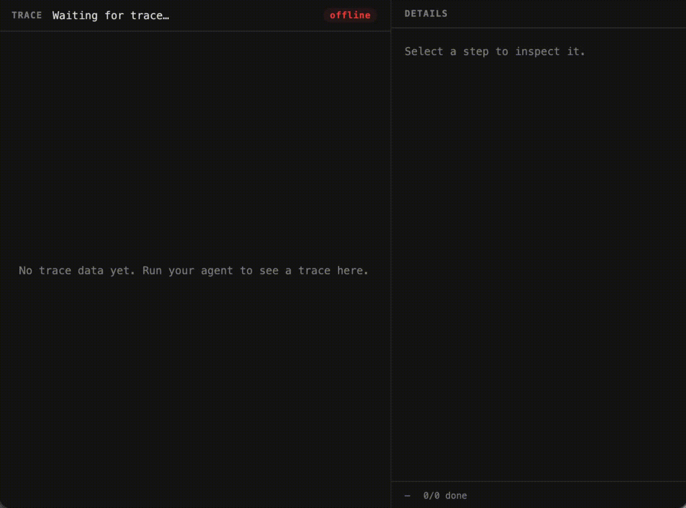

# cleAIr

Explainable agent observability.


## SDKs

| Language | Path | Status |
|----------|------|--------|
| Python | [`sdks/python/`](sdks/python/) | Available |
| TS/JS | `sdks/typescript/` | Planned |


## Install Python SDK

Clone the repository, then install with:

```bash
pip install -e sdks/python
```


## Python SDK Example Using the Observe Decorator

```python
from cleair import observe

@observe(name="llm", capture_output=True)
def llm() -> None:
    ...

@observe()
def main() -> None:
    llm()
```


## Demo



_Real-time trace view from a running agent session._


## License

[GPLv3](LICENSE)
