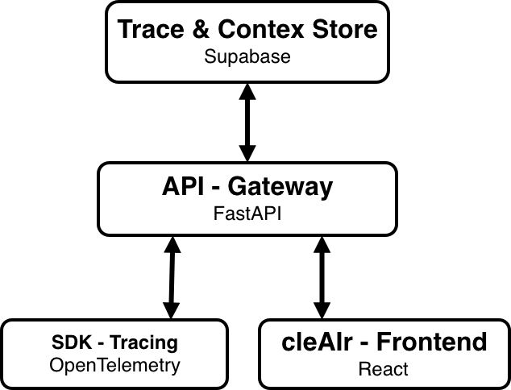

# cleair documentation


Make sure you are using Python 3.10 or later, then run the following command to install the Python SDK:
``` { .bash .install-command }
pip install "cleair @ git+https://github.com/cleairlabs/cleair.git@main#subdirectory=sdks/python"
```


cleair is an agent observability and governance application built on OpenTelemetry.
It currently only offers a Python SDK (JS/TS SDK planned).
The Python SDK instruments agent runs and exports traces to a FastAPI ingestion service.
The API processes trace events, keeps the current run state, and streams live updates to connected clients.
The React frontend presents each run as a structured trace, making it easier to follow agent activity and inspect individual spans.

{ width="420" .architecture-image }
